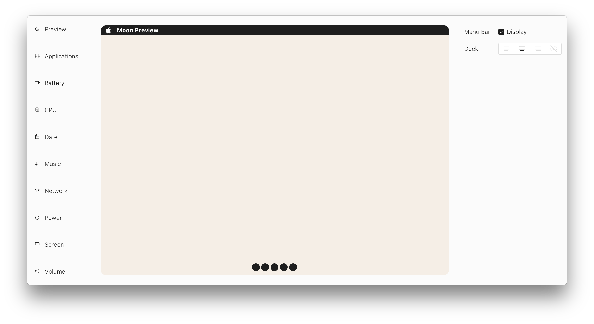

# M☾☾N

Beautiful, customizable menu bars for macOS. Runs as a standalone application without the need for supporting applications like Ubersicht.



## Install

```
$ git clone https://github.com/pacocoursey/moon.git
$ cd Moon
$ npm install
$ npm start
```

Keep in mind this project is still under development.

## Widgets

* [ ] Applications
* [ ] Battery
* [ ] CPU
* [ ] Date & Time
* [ ] Music
* [ ] Network
* [ ] Power
* [ ] Screen
* [ ] Volume

### UI

* [X] Select Menu
* [X] Segmented Control
* [X] Text Input
* [X] Buttons
* [X] Checkbox
* [ ] Alert

### Settings

* [ ] Corners (square/round)
* [ ] Resizable
* [ ] Always on top
* [ ] Focusable
* [ ] Shadow
* [ ] Display on all desktops

### Options

* [ ] Hide
* [ ] Position
* [ ] Size
* [ ] Background color
* [ ] Typeface
* [ ] Text Alignment
* [ ] Font size & color
* [ ] Border (+color, +size)
* [ ] Icon (true/false, custom)

#

<p align="center">
  <a href="http://paco.sh"></a>
</p>
